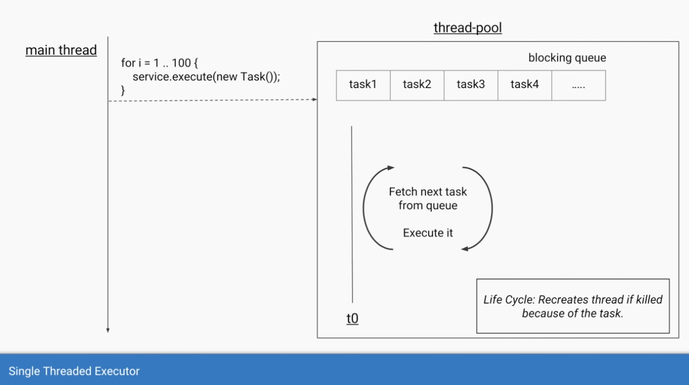
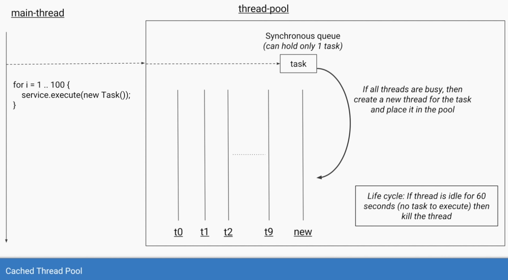
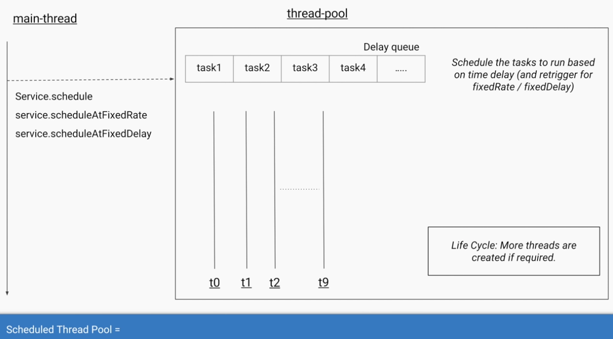

# Executors

The ColdBox AsyncManager will allow you to register and manage different types of executors that can execute your very own tasks! Each executor acts as a singleton and can be configured uniquely. (See: [https://docs.oracle.com/javase/8/docs/api/java/util/concurrent/ExecutorService.html](https://docs.oracle.com/javase/8/docs/api/java/util/concurrent/ExecutorService.html))

You can also create executors on the fly so your async futures can use them as well for ONLY that execution stage.

> Nice video explaining the Java Executor Service: [https://www.youtube.com/watch?v=6Oo-9Can3H8\&t=2s](https://www.youtube.com/watch?v=6Oo-9Can3H8\&t=2s)

### Executor Types

The types that we currently support are:

* `fixed` : By default it will build one with **20** threads on it. Great for multiple task execution and worker processing.

 (1).png>)

* `single` : A great way to control that submitted tasks will execute in the order of submission much like a FIFO queue (First In First Out).



* `cached` : An unbounded pool where the number of threads will grow according to the tasks it needs to service. The threads are killed by a default 60 second timeout if not used and the pool shrinks back to 0.



* `scheduled` : A pool to use for scheduled tasks that can run one time or periodically. The default scheduled task queue has **20** threads for processing.



Please note that each executor is unique in its way of operation, so make sure you read about each type in the JavaDocs or watch this amazing video: [https://www.youtube.com/watch?v=sIkG0X4fqs4](https://www.youtube.com/watch?v=sIkG0X4fqs4)

### Executor Methods

Here are the methods you can use for registering and managing singleton executors in your application:

* `newExecutor()` : Create and register an executor according to passed arguments.  If the executor exists, just return it.
* `newScheduledExecutor()` : Create a scheduled executor according to passed arguments. Shortcut to `newExecutor( type: "scheduled" )`
* `newSingleExecutor()` : Create a single thread executor. Shortcut to `newExecutor( type: "single", threads: 1 )`
* `newCachedExecutor()` : Create a cached thread executor. Shortcut to `newExecutor( type: "cached" )`
* `getExecutor()` : Get a registered executor registerd in this async manager
* `getExecutorNames()` : Get the array of registered executors in the system
* `hasExecutor()` : Verify if an executor exists
* `deleteExecutor()` : Delete an executor from the registry, if the executor has not shutdown, it will shutdown the executor for you using the shutdownNow() event
* `shutdownExecutor()` : Shutdown an executor or force it to shutdown, you can also do this from the Executor themselves. If an un-registered executor name is passed, it will ignore it
* `shutdownAllExecutors()` : Shutdown all registered executors in the system
* `getExecutorStatusMap()` : Returns a structure of status maps for every registered executor in the manager. This is composed of tons of stats about the executor.

And here are the full signatures:

```javascript
/**
 * Creates and registers an Executor according to the passed name, type and options.
 * The allowed types are: fixed, cached, single, scheduled with fixed being the default.
 *
 * You can then use this executor object to submit tasks for execution and if it's a
 * scheduled executor then actually execute scheduled tasks.
 *
 * Types of Executors:
 * - fixed : By default it will build one with 20 threads on it. Great for multiple task execution and worker processing
 * - single : A great way to control that submitted tasks will execute in the order of submission: FIFO
 * - cached : An unbounded pool where the number of threads will grow according to the tasks it needs to service. The threads are killed by a default 60 second timeout if not used and the pool shrinks back
 * - scheduled : A pool to use for scheduled tasks that can run one time or periodically
 *
 * @see https://docs.oracle.com/javase/8/docs/api/java/util/concurrent/ExecutorService.html
 *
 * @name The name of the executor used for registration
 * @type The type of executor to build fixed, cached, single, scheduled
 * @threads How many threads to assign to the thread scheduler, default is 20
 * @debug Add output debugging
 * @loadAppContext Load the CFML App contexts or not, disable if not used
 *
 * @return The ColdBox Schedule class to work with the schedule: coldbox.system.async.tasks.Executor
 */
Executor function newExecutor(
    required name,
    type                   = "fixed",
    numeric threads        = this.$executors.DEFAULT_THREADS,
    boolean debug          = false,
    boolean loadAppContext = true
)

/**
 * Shortcut to newExecutor( type: "scheduled" )
 */
Executor function newScheduledExecutor(
    required name,
    numeric threads        = this.$executors.DEFAULT_THREADS,
    boolean debug          = false,
    boolean loadAppContext = true
)

/**
 * Shortcut to newExecutor( type: "single", threads: 1 )
 */
Executor function newSingleExecutor(
    required name,
    boolean debug          = false,
    boolean loadAppContext = true
)

/**
 * Shortcut to newExecutor( type: "cached" )
 */
Executor function newCachedExecutor(
    required name,
    numeric threads        = this.$executors.DEFAULT_THREADS,
    boolean debug          = false,
    boolean loadAppContext = true
)

/**
 * Get a registered executor registerd in this async manager
 *
 * @name The executor name
 *
 * @throws ExecutorNotFoundException
 * @return The executor object: coldbox.system.async.tasks.Executor
 */
Executor function getExecutor( required name )

/**
 * Get the array of registered executors in the system
 *
 * @return Array of names
 */
array function getExecutorNames()

/**
 * Verify if an executor exists
 *
 * @name The executor name
 */
boolean function hasExecutor( required name )

/**
 * Delete an executor from the registry, if the executor has not shutdown, it will shutdown the executor for you
 * using the shutdownNow() event
 *
 * @name The scheduler name
 */
AsyncManager function deleteExecutor( required name )

/**
 * Shutdown an executor or force it to shutdown, you can also do this from the Executor themselves.
 * If an un-registered executor name is passed, it will ignore it
 *
 * @force Use the shutdownNow() instead of the shutdown() method
 */
AsyncManager function shutdownExecutor( required name, boolean force = false )

/**
 * Shutdown all registered executors in the system
 *
 * @force By default (false) it gracefullly shuts them down, else uses the shutdownNow() methods
 *
 * @return AsyncManager
 */
AsyncManager function shutdownAllExecutors( boolean force = false )

/**
 * Returns a structure of status maps for every registered executor in the
 * manager. This is composed of tons of stats about the executor
 *
 * @name The name of the executor to retrieve th status map ONLY!
 *
 * @return A struct of metadata about the executor or all executors
 */
struct function getExecutorStatusMap( name )
```

### Single Use Executors

If you just want to use executors for different completion stages and then discard them, you can easily do so by using the `$executors` public component in the `AsyncManager`. This object can be found at: `coldbox.system.async.util.Executors`:

```javascript
asyncManager.$executors.{creationMethod}()
```

The available creation methods are:

```javascript
this.DEFAULT_THREADS = 20;
/**
 * Creates a thread pool that reuses a fixed number of threads operating off a shared unbounded queue.
 *
 * @see https://docs.oracle.com/javase/8/docs/api/java/util/concurrent/ExecutorService.html
 *
 * @threads The number of threads in the pool, defaults to 20
 *
 * @return ExecutorService: The newly created thread pool
 */
function newFixedThreadPool( numeric threads = this.DEFAULT_THREADS )

/**
 * Creates a thread pool that creates new threads as needed, but will
 * reuse previously constructed threads when they are available.
 *
 * @see https://docs.oracle.com/javase/8/docs/api/java/util/concurrent/ExecutorService.html
 *
 * @return ExecutorService: The newly created thread pool
 */
function newCachedThreadPool()

/**
 * Creates a thread pool that can schedule commands to run after a given delay,
 * or to execute periodically.
 *
 * @see https://docs.oracle.com/javase/8/docs/api/java/util/concurrent/ScheduledExecutorService.html
 *
 * @corePoolSize The number of threads to keep in the pool, even if they are idle, default is 20
 *
 * @return ScheduledExecutorService: The newly created thread pool
 */
function newScheduledThreadPool( corePoolSize = this.DEFAULT_THREADS )
```

This way you can use them and discard them upon further processing.

```javascript
// Create an IO bound pool with 100 threads to process my data
var dataQueue = [ data, data ... data1000 ];
var results = asyncManager
    .newFuture( executor : asyncManager.$executors.newFixedThreadPool( 100 ) )
    .allApply( dataQueue, ( item ) => dataService.process( item )  );

// Create two types of thread pools: 1) CPU intesive, 2) IO Intensive
var cpuBound = asyncManager.$executors.newFixedThreadPool( 4 );
var ioBound = asyncManager.$executors.newFixedThreadPool( 50 );

// Process an order with different executor pools
newFuture( () => orderService.getOrder(), ioBound )
    .thenAsync( (order) => enrichOrder( order ), cpuBound )
    .thenAsync( (order) => performPayment( order ), ioBound )
    .thenAsync( (order) => dispatchOrder( order ), cpuBound )
    .thenAsync( (order) => sendConfirmation( order ), ioBound );
```

### ColdBox Task Scheduler

Every ColdBox application will register a task scheduler called `coldbox-tasks` which ColdBox internal services can leverage it for tasks and schedules. It is configured with 20 threads and using the `scheduled` type. You can leverage if you wanted to for your own tasks as well.

```javascript
property name="scheduler" inject="executor:coldbox-tasks";

async().getExecutor( "coldbox-tasks" );
```

### ColdBox Application Executor Registration

We have also added a new configuration struct called `executors` which you can use to register global executors or per-module executors.

```javascript
// In your config/ColdBox.cfc
function configure(){

    executors = {
        "name" : {
            "type" : "fixed",
            "threads" : 100
        }
    };

}
```

Each executor registration is done as a struct with the name of the executor and at most two settings:

* `type` : The executor type you want to register
* `threads` : The number of threads to assign to the executor

#### ModuleConfig.cfc

You can also do the same at a per-module level in your module's `ModuleConfig.cfc`.

```javascript
// In your ModuleConfig.cfc
function configure(){

    executors = {
        "name" : {
            "type" : "fixed",
            "threads" : 100
        }
    };

}
```

ColdBox will register your executors upon startup and un-register and shut them down when the module is unloaded.

### WireBox Injection DSL

We have extended WireBox so you can inject registered executors using the following DSL: `executors:{name}`

```javascript
// Inject an executor called `taskScheduler` the same name as the property
property name="taskScheduler" inject="executor";
// Inject the `coldbox-tasks` as `taskScheduler`
property name="taskScheduler" inject="executor:coldbox-tasks";
```
