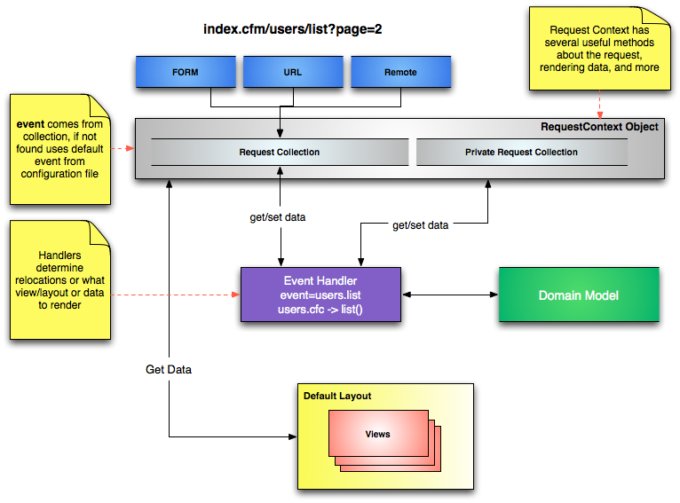

# Working With Event Handlers



Event handlers are the _controller_ layer in ColdBox and is what you will be executing via the `URL`or a `FORM`post. All event handlers are **singletons**, which means they are cached for the duration of the application, so always remember to var scope your variables in your functions.


**Tip:** For development we highly encourage you to turn handler caching **off** or you will have to reinit the application in every request, which is **annoying**. Open the `config/ColdBox.cfc` and look for the `coldbox.handlerCaching` setting. &#x20;


**By default this is already done for you on the application templates.**



```javascript
/**
 * Development environment
 */
function development() {
    coldbox.customErrorTemplate = "/coldbox/system/exceptions/Whoops.cfm"; // interactive bug report
    coldbox.handlerCaching = false;
    coldbox.handlersIndexAutoReload = true;
    coldbox.eventCaching = false;
    coldbox.viewCaching = false;
}
```


## Handler Code

Go open the `handlers/main.cfc` and let's explore the code.

```javascript
component extends="coldbox.system.EventHandler" {

    /**
     * Default Action
     */
    function index( event, rc, prc ) {
        prc.welcomeMessage = "Welcome to ColdBox!";
        event.setView( "main/index" );
    }

    /**
     * Produce some restfulf data
     */
    function data( event, rc, prc ) {
        return [
            { "id" : createUUID(), name : "Luis" },
            { "id" : createUUID(), name : "JOe" },
            { "id" : createUUID(), name : "Bob" },
            { "id" : createUUID(), name : "Darth" }
        ];
    }

    /**
     * Relocation example
     */
    function doSomething( event, rc, prc ) {
        relocate( "main.index" );
    }

    /************************************** IMPLICIT ACTIONS *********************************************/

    function onAppInit( event, rc, prc ) {
    }

    function onRequestStart( event, rc, prc ) {
    }

    function onRequestEnd( event, rc, prc ) {
    }

    function onSessionStart( event, rc, prc ) {
    }

    function onSessionEnd( event, rc, prc ) {
        var sessionScope     = event.getValue( "sessionReference" );
        var applicationScope = event.getValue( "applicationReference" );
    }

    function onException( event, rc, prc ) {
        event.setHTTPHeader( statusCode = 500 );
        // Grab Exception From private request collection, placed by ColdBox Exception Handling
        var exception = prc.exception;
        // Place exception handler below:
    }

}
```

Let's recap: Every action in ColdBox receives three arguments:

* `event` - An object that models and is used to work with the current request, called the [request context](../../the-basics/request-context.md).
* `rc` - A struct that contains both URL/FORM variables (unsafe data)
* `prc` - A secondary struct that is private only settable from within your application (safe data)

## Setting Views - Default Layout

This line `event.setView( "main/index" )` in the `index` action told ColdBox to render a view back to the user found in `views/main/index.cfm`. &#x20;

ColdBox also has the concept of layouts, which are essentially reusable views that can wrap up other views or layouts.  They allow you to reuse content to render views/layouts inside a specific location in the CFML content.  By convention, ColdBox looks for a layout called `layouts/Main.cfm.`  This is yet another convention, the default layout.  Your application can have many layouts or non-layouts at all.

## Working With Incoming Data

Now, let's open the handler we created before called `handlers/hello.cfc` and add some public and private variables so our views can render the variables.

```cfscript
function index( event, rc, prc ){
    // param an incoming variable.
    event.paramValue( "name", "nobody" );
    // set a private variable
    prc.when = dateFormat( now(), "full" );
    // set the view to render
    event.setView( "hello/index" );
}
```

Let's open the view now: `views/hello/index.cfm` and change it to this:

```markup
<cfoutput>
<p>Hello #encodeForHTML( rc.name )#, today is #prc.when#</p>
</cfoutput>
```


Please note that we used the ColdFusion function `encodeForHTML()` ([https://cfdocs.org/encodeforhtml](https://cfdocs.org/encodeforhtml)) on the public variable. Why? Because you can **never** trust the client and what they send, make sure you use the built-in ColdFusion encoding functions in order to avoid XSS hacks or worse on incoming public (`rc`) variables.


If you execute the event now: `http://localhost:{port}/hello/index` you will see a message of `Hello nobody`.

Now change the incoming URL to this: `http://localhost:{port}/hello/index?name=ColdBox` and you will see a message of `Hello ColdBox`.


**Tip:** Please see the [layouts and views](../../the-basics/layouts-and-views/) section for in-depth information.


### Routing Params

Now let's expect the name as part of the URL pattern; open the `config/Router.cfc` and let's add another route:

```cfscript
route( "/hello/:name" ).as( "hello" ).to( "hello" )
```

We use the `:` colon to denote incoming URL/FORM placeholder params that, if found are translated to the request collection (`rc`).  So let's try it out: `http://localhost:{port}/hello/coldbox`

You can use the `route()` to generate the URL with params in a nice struct way:

```html
<a href="#event.route( "hello", { name: "Luis" } )#">Say Hello Luis</a>
```
