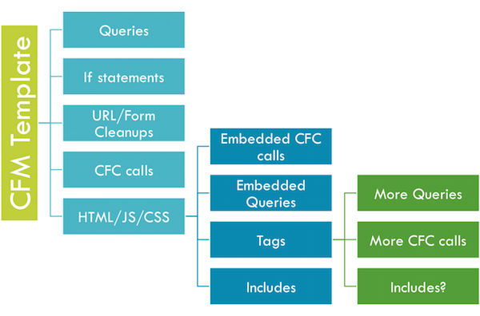

# Models

ColdBox allows you to integrate with the model layer easily by leveraging **WireBox** as your default dependency injection framework. However, you can integrate your model layer with any third-party DI framework via our `cbioc` module ([https://github.com/ColdBox/cbox-ioc](https://github.com/ColdBox/cbox-ioc)) as well.

## Spaghetti Evolution

Remember this:

Did you get some spine shivers like I just did? WOW! That is the traditional spaghetti coding style. With ColdBox we are now moving into MVC land and focusing on the model layer.

.png>)

However, the model layer can even be subdivided into many layers as well as we will investigate in this section.

## WireBox

WireBox, our dependency injection and AOP framework, will do all the magic of building, wiring objects with dependencies and helping you persist objects in some state (singletons, transients, request, etc). The main purpose for model integration is to make the developer's development workflow easier! And we all like that Easy button!

## Benefits

* Easily create and retrieve model objects by using one method: `getInstance()`
* Easily handle model or handler dependencies by using `cfproperty` and constructor argument conventions.
* An Injection DSL (Domain Specific Language) has been created to facilitate dependencies
* Easily determine what scope model objects should be persisted in: Transients, Singletons, Cache, Request, Session, etc.
* Easily create a configuration binder to create aliases or complex object relationships (Java, WebServices, RSS, etc.)
* Easily do FORM data binding or advanced ORM data binding
* Easily compose ORM relationships from request data

Wow! You can do all that? Yes and much more. So let's begin.
